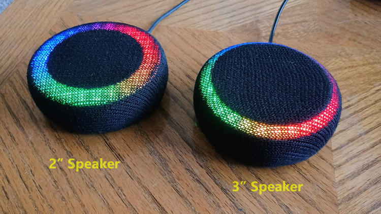
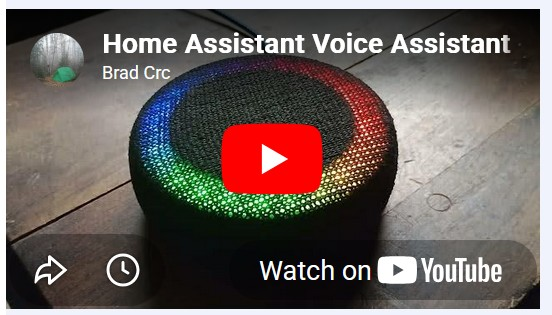
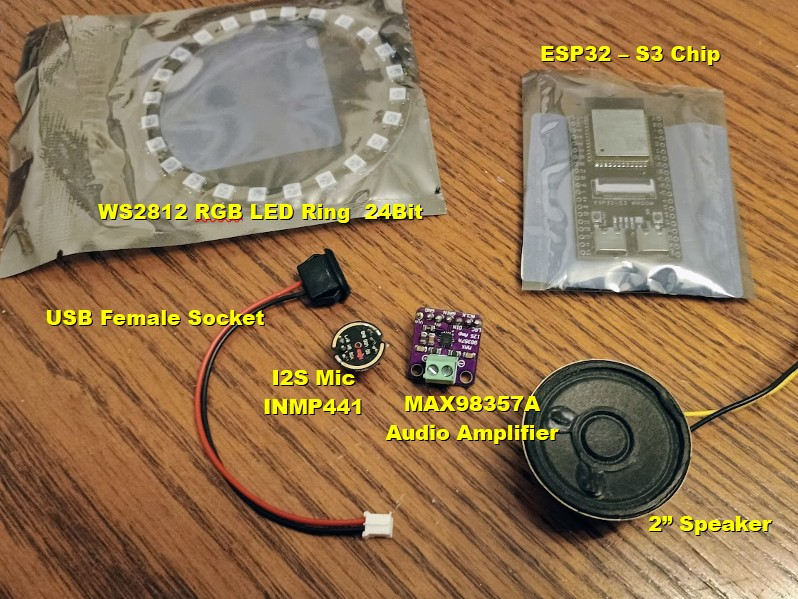
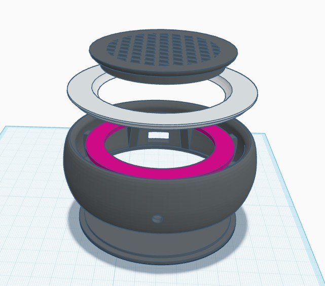
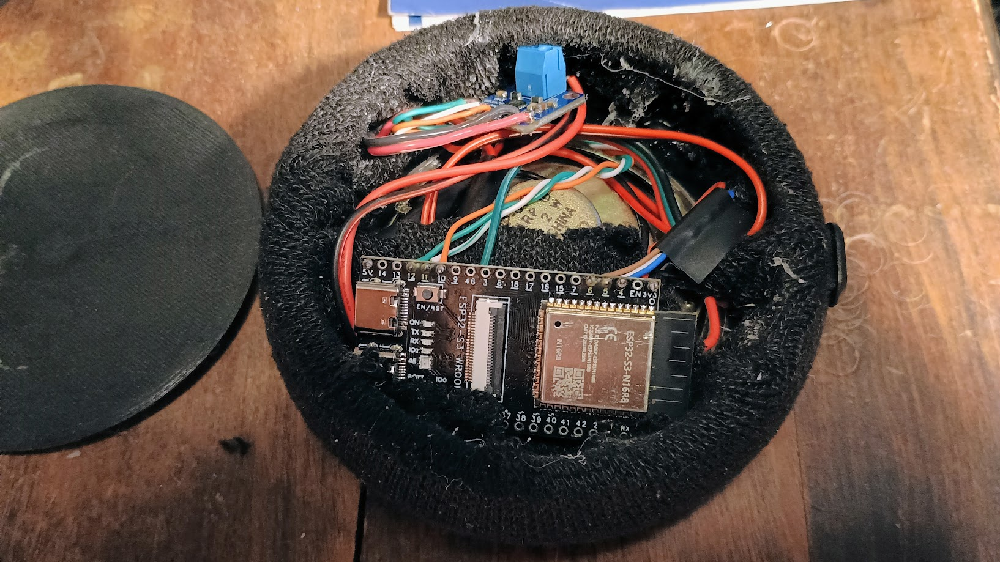

# Voice Assistant Device for Home Assistant with Circle LED

Simple basic puck voice assistant for Home Assistant.  

3D Printing - Download STL Files
* [Thingiverse](https://www.thingiverse.com/thing:7357076)
* [Printables](https://www.printables.com/model/1755450-home-assistant-voice-assistant-puck-with-ring-ligh)

## Required Parts

## Wiring

Wiring for the device.

## Assembly

The 3d printed parts are assembled as in this image.

The components are crammed into the small case.  It's a tight fit.
